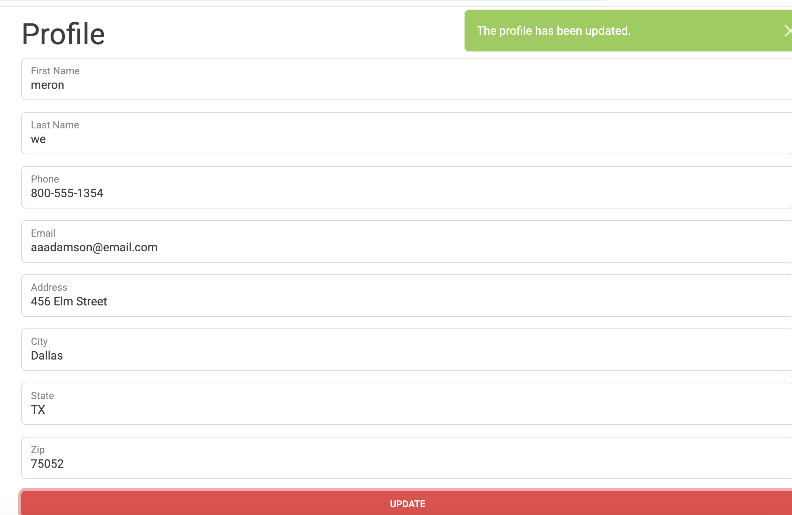

# Capstone 3: EasyShop By Meron Weldselase

## Project Overview

EasyShop is a full-stack e-commerce web application that allows users to browse products by category, manage a shopping
cart, and place orders securely.
The project includes a Java Spring Boot backend API and a static HTML/CSS/JavaScript frontend that communicates with 
the backend using RESTful endpoints.
This application demonstrates backend development concepts such as authentication, authorization, database access using
DAOs, and transactional order processing, along with frontend integration .


## Tech Stack

# Backend
- Java
- Spring Boot
- RESTful APIs
- JDBC / DAO Pattern
- MySQL
- Apache DBCP (Connection Pooling)

# Frontend
- Angular
- TypeScript
- HTML / CSS
- REST API consumption

# Tools
- IntelliJ IDEA
- Git & GitHub
- Insomnia (API testing)
- MySQL Workbench

## Features

- Create, read, update, and delete (CRUD) products
- RESTful API with proper HTTP status codes
- Backend validation and error handling
- Duplicate product handling during updates
- Frontend connected to backend services
- Clean separation of concerns (Controller, DAO, Model)

## API Endpoints

- Method	Endpoint	             Description
- GET	    /products	             Get all products
- GET	    /products/{id}	         Get product by ID
- POST     	/products	             Create new product
- PUT	    /products/{id}	         Update existing product
- DELETE	/products/{id}	         Delete product


## Class i have made
 
# Categories
- Updated how products are displayed based on selected categories
- Connected category selection to dynamically filter products
- Ensured the UI updates immediately when a category is changed


# Profile
- Built and updated the Profile page
- Displayed user information retrieved from the backend (or mock service)
- Structured the profile UI to support future updates/editing


# Add to Cart
- implemented Add to Cart functionality
- Prevented duplicate products from being added to the cart
- Increased quantity when the same product is added again
- Calculated cart totals dynamically

- Logic used 

```// Pseudocode / logic explanation
  if (product already exists in cart) {
  increase quantity
  } else {
  add product to cart
  }
```

# Product

- Fixed update logic to prevent duplicate product creation
- Ensured updates only apply to existing products
- Returned proper HTTP status codes

Main Code used
```
public void updateProduct(@PathVariable int id, @RequestBody Product product) {
Product existing = productDao.getById(id);

    if (existing == null)
        throw new ResponseStatusException(HttpStatus.NOT_FOUND);

    product.setProductId(id);
    productDao.update(id, product);
}
```

## Highlighted Implementation (Duplicate Handling)

One important part of this project is how product updates are handled safely.
Before updating, the application checks whether the product exists and ensures the ID from the URL is enforced, 
preventing accidental duplicate creation.

```
public void updateProduct(@PathVariable int id, @RequestBody Product product) {
try {
// Check if product exists first
Product existing = productDao.getById(id);

        if (existing == null)
            throw new ResponseStatusException(HttpStatus.NOT_FOUND);

        // Ensure the object uses the ID from the URL
        product.setProductId(id);

        // Perform UPDATE (not create)
        productDao.update(id, product);
    }
    catch (ResponseStatusException ex) {
        throw ex;
    }
    catch (Exception ex) {
        throw new ResponseStatusException(
            HttpStatus.INTERNAL_SERVER_ERROR,
            "Oops... our bad."
        );
    }
}
```

## What I Learned

- Building and connecting a full-stack application
- Implementing RESTful APIs using Spring Boot
- Using DAO patterns and SQL effectively
- Handling edge cases like duplicate updates
- Debugging backend-frontend integration issues
- Writing cleaner, more maintainable backend code

## Challenges & Solutions (Add to Cart & Shopping)
One of the main challenges I faced was preventing the same product from being added to the cart multiple times as 
separate entries. Initially, each click on “Add to Cart” created a new cart item, which caused incorrect quantities
and totals.